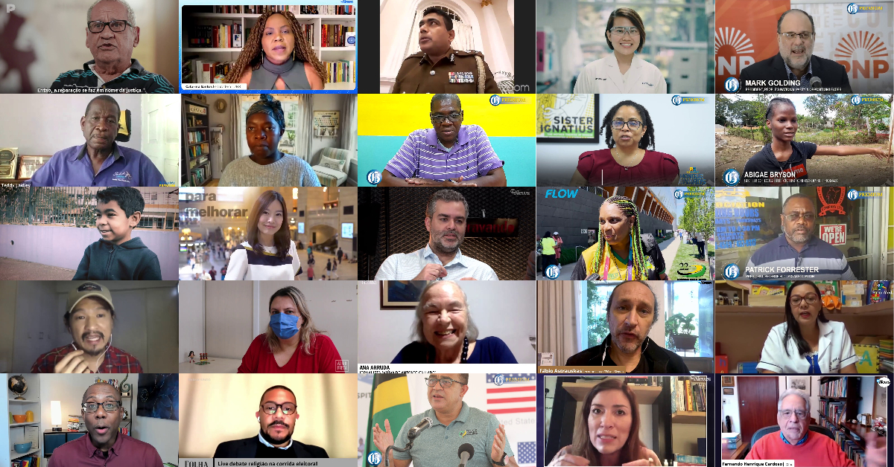

<h1>Presenter-Centric Image Collection and Annotation: Enhancing Accessibility for the Visually Impaired</h1>




This repository contains the proposed dataset of the paper **[Presenter-Centric Image Collection and Annotation: Enhancing Accessibility for the Visually Impaired]()** published at *36th SIBGRAPI Conference on Graphics, Patterns and Images (SIBGRAPI), 2023*.

We propose an approach to collect data automatically and a protocol to annotate this data specifically for this audience, aiming to support the development of Assistive Technology systems. We provide access to our three datasets: complete dataset, single person dataset, and annotated single person dataset. The complete dataset contains 10.939 images, the single person dataset contains 5689 images and the annotated single person dataset contains 967 images, each accompanied by three descriptive annotations. The images were collected from [youtube.com](https://www.youtube.com/). 

If you find this code useful for your research, please cite the paper:

```
@INPROCEEDINGS{Ferreira_2023_Sibgrapi,
  author={Luísa Ferreira and Daniel Fernandes and Fabio Cerqueira and Marcos Ribeiro and Michel Silva},
  booktitle={36th SIBGRAPI Conference on Graphics, Patterns and Images (SIBGRAPI)}, 
  title={Presenter-Centric Image Collection and Annotation: Enhancing Accessibility for the Visually Impaired}, 
  month = {TO APPEAR},
  year={},
  volume={},
  number={},
  pages={},
  doi={}
}
```

---

Access Datasets:
===
We're giving you a script along with text files that list the filenames for each image in the dataset. These filenames include important info like YouTube ID and frame ID, which the script uses to fetch the images.

- ### 1 . Install requirements
    You can find the necessary libraries to run the Python script in the `dataset/requirements.txt` file.


    ```bash
    pip install -r requirements.txt
    ```

- ### 2 . Running the script
    To get the images from the dataset, use the `dataset/collect_images.py` script. You'll need to give the file path as an argument. For instance, if you want images from the complete dataset, provide the path to the complete_dataset.txt file. The annotations for the annotated single-person dataset are available in `dataset/annotations.csv`. As mentioned in the paper, there are 684 images with three descriptors, 190 with two descriptors, and 93 with a single descriptor.
    ```bash
    python collect_images.py path/to/txt/file
    ```

---

Following the steps provided, you'll acquire the images from the datasets.


Contact
===

Authors
---

* Luísa Ferreira - BsC student - UFV - luisa.ferreira@ufv.br.br
* Daniel Fernandes - PhD student - UFV - daniel.louzada@ufv.br
* Fábio Cerqueira -  - UFF - frcerqueira@id.uff.br
* Marcos Henrique - Professor at Universidade Federal de Viçosa (UFV) - marcosh.ribeiro@ufv.br
* [Michel Silva](https://michelmelosilva.github.io/) - Assistant Professor at Universidade Federal de Viçosa (UFV) - michel.m.silva@ufv.br

Institution
---

Universidade Federal de Viçosa (UFV)  
Departamento de Ciência da Computação  
Viçosa- Minas Gerais -Brazil 

Laboratory
---
 | 
--- | ---


**MaVILab:** Machine Vision and Intelligence Laboratory
https://mavilab-ufv.github.io/

---

Acknowledgements
===

We would like to thanks CAPES, FAPEMIG and CNPq for funding this work; [Ricson Luiz Oliveira Vilaça}(https://github.com/ricsonl) for fine-tunning the scene classification CNN; and our tireless annotators Allan Lopes, Júlia Vieira, Júlia Lopes, and Sophia Jorge.

### Enjoy it! :smiley:
